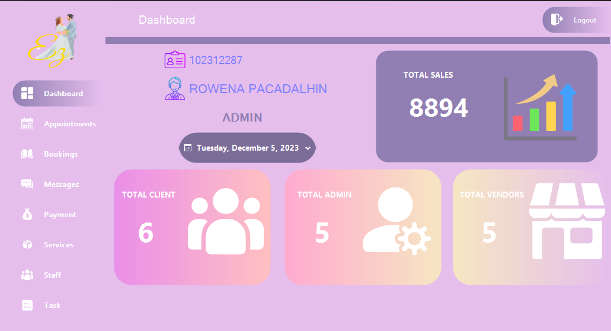

# WeddingManagementSystem
A system that manages client's wedding preparation. Admin have the ability to handle client, vendor and planner's information. Set up an appointment for the client. Radio Frequency Identification (RFID) is use for admin access and GSM Module for sending notification to clients

        

